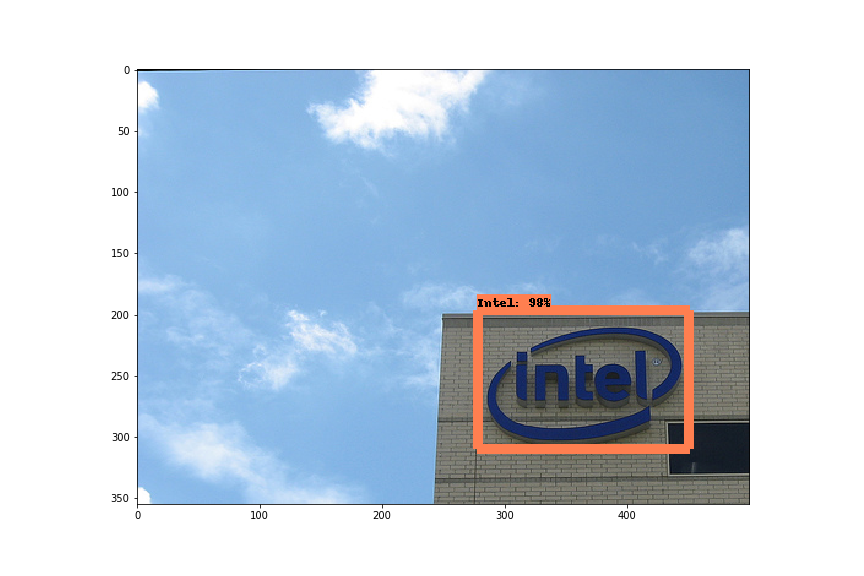
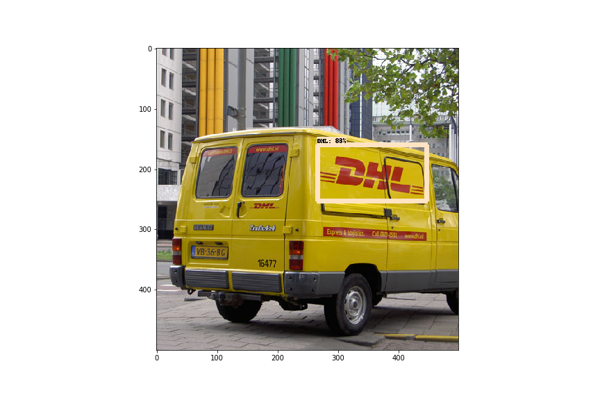
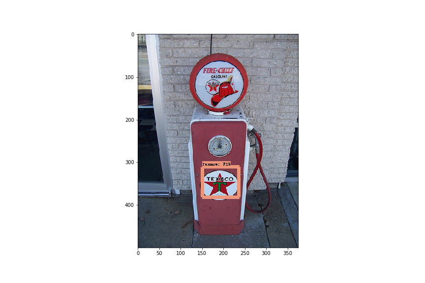
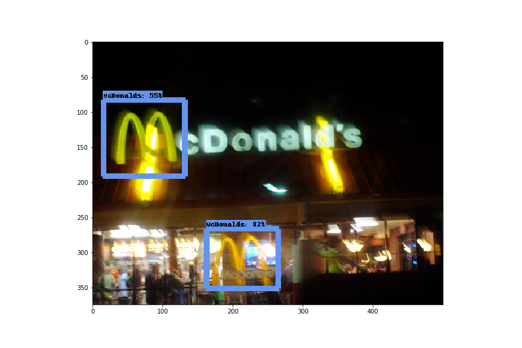

DeepLogo
---
A brand logo detection system using Tensorflow Object Detection API.

## Description

Tensorflow Object Detection API is the easy to use framework for creating a custom deep learning model that solves object detection problems.

If you already have your own dataset, you can simply create a custom model with sufficient accuracy using a collection of detection models pre-trained on COCO, KITTI, and OpenImages dataset.

DeepLogo provides training and evaluation environments of Tensorflow Object Detection API for creating a brand logo detection model.

## Detection Results

These are some detection results by DeepLogo.

|||
|---|---|
|||
|||
|||

## Training DeepLogo

DeepLogo uses SSD as a backbone network and fine-tunes pre-trained SSD released in the tensorflow/models repository.

In order to use that pre-trained model, setting up the tensorflow/models repository first.

1. Clone the tensorflow/models repository and download the pre-trained model from model zoo.
   ```
   $ git clone https://github.com/tensorflow/models.git
   $ cd models/research/object_detection
   $ wget http://download.tensorflow.org/models/object_detection/ssd_inception_v2_coco_2018_01_28.tar.gz
   $ tar zxvf ssd_inception_v2_coco_2018_01_28.tar.gz
   ```
   Tensorflow Object Detection API depends on many other libraries.
   For detailed steps to setup, please follow the [official installation instruction](https://github.com/tensorflow/models/blob/master/research/object_detection/g3doc/installation.md).
3. Clone the DeepLogo repository.
   ```
   $ git clone https://github.com/satojkovic/DeepLogo.git
   ```
4. Download the flickr logos 27 dataset from [here](http://image.ntua.gr/iva/datasets/flickr_logos/).

   The flickr logos 27 dataset contains 27 classes of brand logo images downloaded from Flickr. The brands included in the dataset are: Adidas, Apple, BMW, Citroen, Coca Cola, DHL, Fedex, Ferrari, Ford, Google, Heineken, HP, McDonalds, Mini, Nbc, Nike, Pepsi, Porsche, Puma, Red Bull, Sprite, Starbucks, Intel, Texaco, Unisef, Vodafone and Yahoo.
   ```
   $ cd DeepLogo
   $ wget http://image.ntua.gr/iva/datasets/flickr_logos/flickr_logos_27_dataset.tar.gz
   $ tar zxvf flickr_logos_27_dataset.tar.gz
   $ cd flickr_logos_27_dataset
   $ tar zxvf flickr_logos_27_dataset_images.tar.gz
   $ cd ../
   ```
5. Preprocess

   The flickr logos 27 dataset contains an annotation file for training. This file includes not valid annotations such as an empty size bounding box. Therefore these annotations are removed in this preprocess step, then class names are converted into class numbers and generate two preprocessed files. These two files are used to generate tfrecord files.
   ```
   $ cd DeepLogo
   $ python preproc_annot.py
   ```
6. Generate tfrecord files.

   The Tensorflow Object Detection API expects data to be in the TFRecord format. Run the following command to convert from preprocessed files into TFRecords.
   ```
   $ python gen_tfrecord.py --train_or_test train --csv_input flickr_logos_27_dataset/flickr_logos_27_dataset_training_set_annotation_cropped.txt --img_dir flickr_logos_27_dataset/flickr_logos_27_dataset_images --output_path train.tfrecord
   $ python gen_tfrecord.py --train_or_test test --csv_input flickr_logos_27_dataset/flickr_logos_27_dataset_test_set_annotation_cropped.txt --img_dir flickr_logos_27_dataset/flickr_logos_27_dataset_images --output_path test.tfrecord
   ```
7. Training

   The Tensorflow Object Detection API has a python script for training called train.py. This script needs two arguments `--pipeline_config_path` and `--train_dir`. (see below)

   DeepLogo assumes that the current directory is under the DeepLogo directory and also the path of pre-trained SSD and tfrecord is the relative path from DeepLogo (these paths are written in ssd_inception_v2.config). Therefore create a symbolic link to the directory of tensorflow/models/research/object_detection/ssd_inception_v2_coco_2018_01_28 first, then run the training script.

   ```bash
   $ ln -s <OBJECT_DETECTION_API_DIR>/ssd_inception_v2_coco_2018_01_28 ssd_inception_v2_coco_2018_01_28
   $ python <OBJECT_DETECTION_API_DIR>/legacy/train.py --logtostderr --pipeline_config_path=ssd_inception_v2.config --train_dir=training
   ```

   Note: DeepLogo doesn't work in Tensorflow 2.0. When you try to train DeepLogo, checkout `5ba3c3f5` of tensorflow/models.

8. Export as pb file.  
   ```
   $ python <OBJECT_DETECTION_API_DIR>/export_inference_graph.py --input_type=image_tensor --pipeline_config_path=ssd_inception_v2.config --trained_checkpoint_prefix=model.ckpt-<STEPS> --output_directory=logos_inference_graph
   ```
   \<STEPS> is the steps at training, for example model.ckpt-1234.

9.  Testing logo detector.
   ```
   $ python logo_detection.py --model_name logos_inference_graph/ --label_map flickr_logos_27_label_map.pbtxt --test_annot_text flickr_logos_27_dataset/flickr_logos_27_dataset_test_set_annotation_cropped.txt --test_image_dir flickr_logos_27_dataset/flickr_logos_27_dataset_images --output_dir detect_results
   ```

## Evaluation

First, modify num_examples field in training/pipeline.config file.

```
eval_config: {
  num_examples: 438
  # Note: The below line limits the evaluation process to 10 evaluations.
  # Remove the below line to evaluate indefinitely.
  max_evals: 10
}
```

This value is from flickr_logos_27_dataset_test_set_annotation_cropped.txt file.

```bash
$ wc -l flickr_logos_27_dataset/flickr_logos_27_dataset_test_set_annotation_cropped.txt 
     438 flickr_logos_27_dataset/flickr_logos_27_dataset_test_set_annotation_cropped.txt
```

Then start evaluation process by using eval.py provided within tensorflow/models repository.

```
$ python <OBJECT_DETECTION_API_DIR>/legacy/eval.py --logtostderr --checkpoint_dir=training --eval_dir=eval --pipeline_config_path=training/pipeline.config
```

After a while you will get evaluation results. If you want to check the results visually, open tensorboard in your browser.

```bash
$ tensorboard --logdir=eval/
```

## License

MIT
