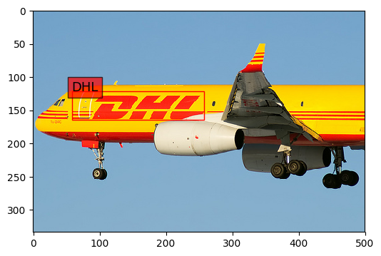
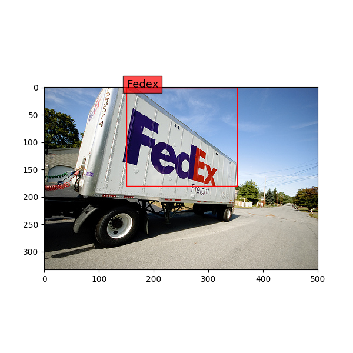
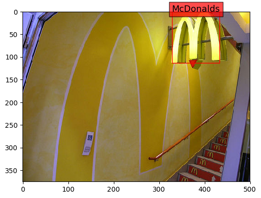
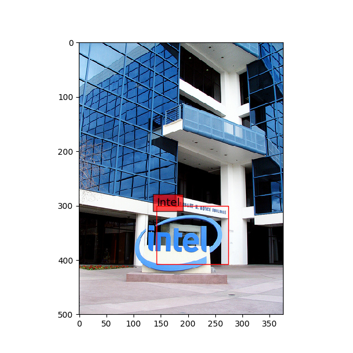
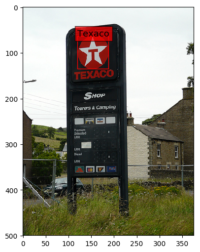
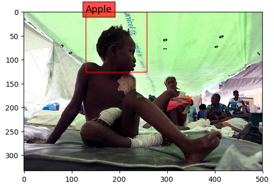
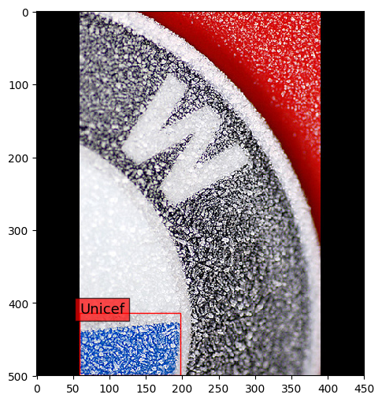

DeepLogo
---
A brand logo detection system using region-based convolutional neural networks.

### Overview

Implentation of Region-based Convolutional Neural Networks in Tensorflow, to detect and classify brand logos.

Note: Since this is my first version model, there are some remaining issues.

Example detection results are below.

Here are some failure cases.

### Usage

0. `python gen_bg_class.py`: Generate train\_annot\_with\_bg\_class.txt file. 
1. `python crop_and_aug.py`: Crop brand logo images from the [flickr27\_logos\_dataset](http://image.ntua.gr/iva/datasets/flickr_logos/) and apply data augmentation method. Finally the dataset consists of 140137 images.
2. `python gen_train_valid_test.py`: Generate(Split) train/valid/test set from the dataset.
3. `python train_deep_logo_cnn.py`: Train the convolutional neural networks and save the trained model to disk.
4. `python test_deep_logo_cnn.py`: Test the trained model (for Classification).  
`python detect_logo.py`: Test the trained model (for Detection)

### Network

The network is based on [this blog post](http://matthewearl.github.io/2016/05/06/cnn-anpr/). Same network is applied to this brand logo recognition task because a brand logo is similar to a number plate which consists of a number of digits and letters.

### License

MIT
